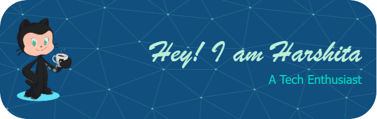

<h1 align="center">Hi 👋, I'm Harshita Prajapati</h1>
<h3 align="center">A Passionate Girl trying to figure out stuff!!</h3>

  

- 🙋‍♂️ All about me is at **[My Website](https://soumyajit.vercel.app/)**

- 🔭 I’m currently working on `MERN Stack`.

- 🌱 I’m currently **looking for amazing work opportunities!!** 

- 👯 I’m looking to collaborate for `Dev Projects`

- 🤔 I’m looking for help with `Competitive Programming`

- 👨‍💻 Life Hack: Learn new tech :fire: and share what you have learned :tada:

- 💬 Ask me about **Data Structures & Algorithms , Web Development**

- 📫 How to reach me ->  **harshitap559@gmail.com**

<h3 align="left">Connect with me:</h3>

## 🛠️ Languages and Tools I use:

 

 

 

<!-- 
&nbsp;

 -->
